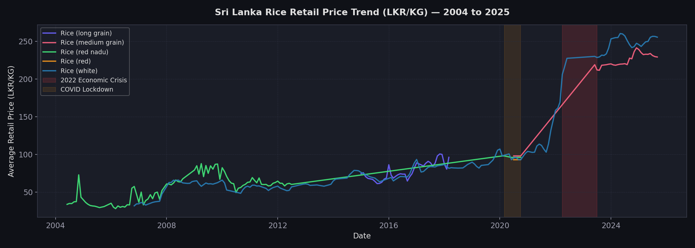
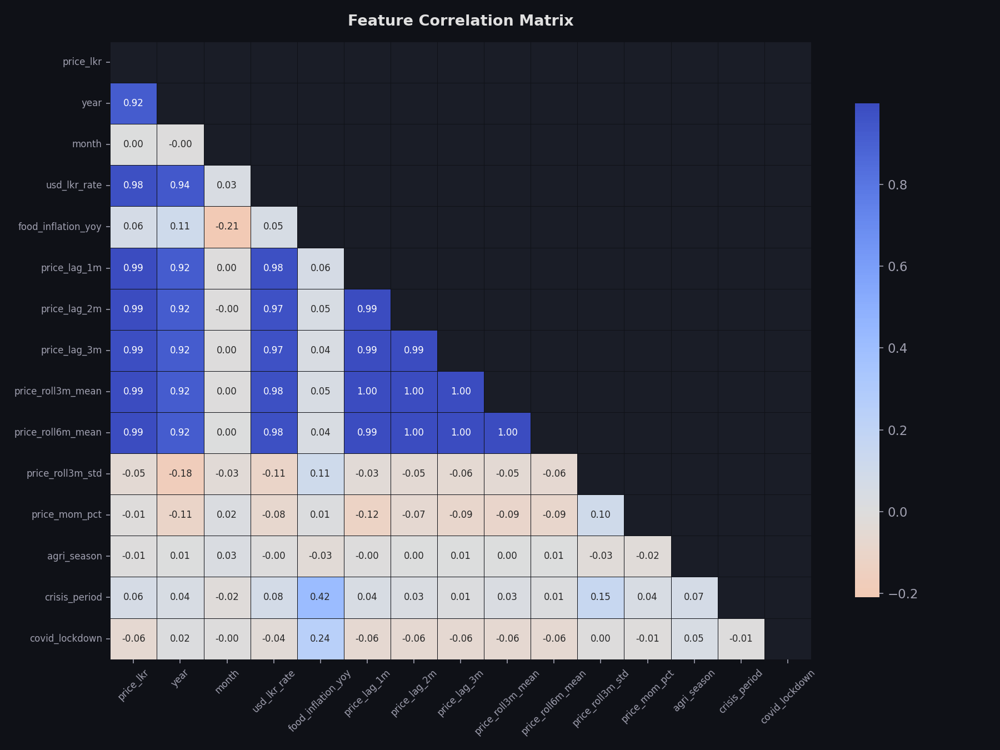
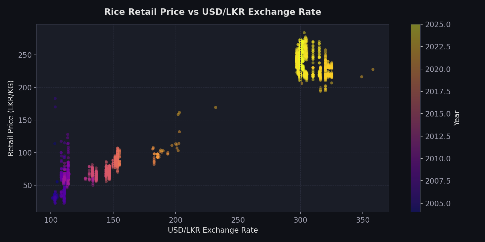
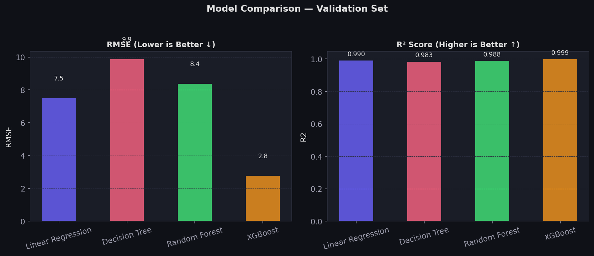
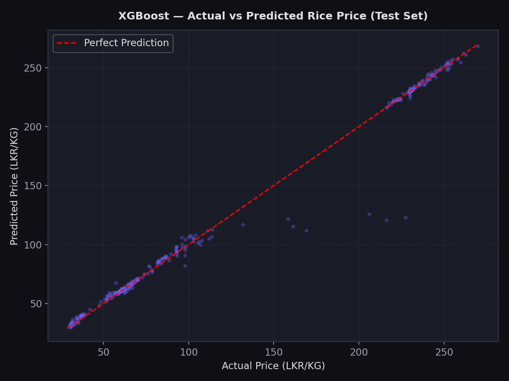
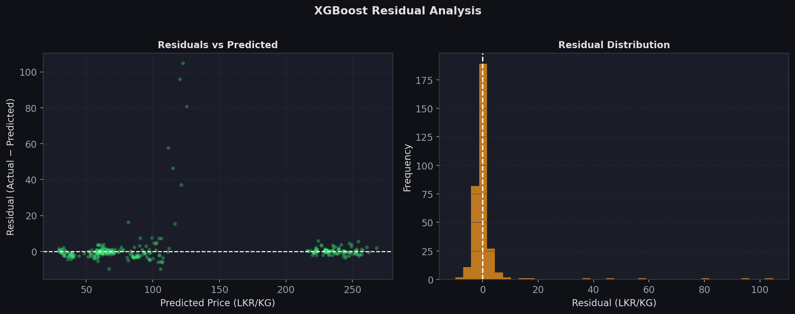
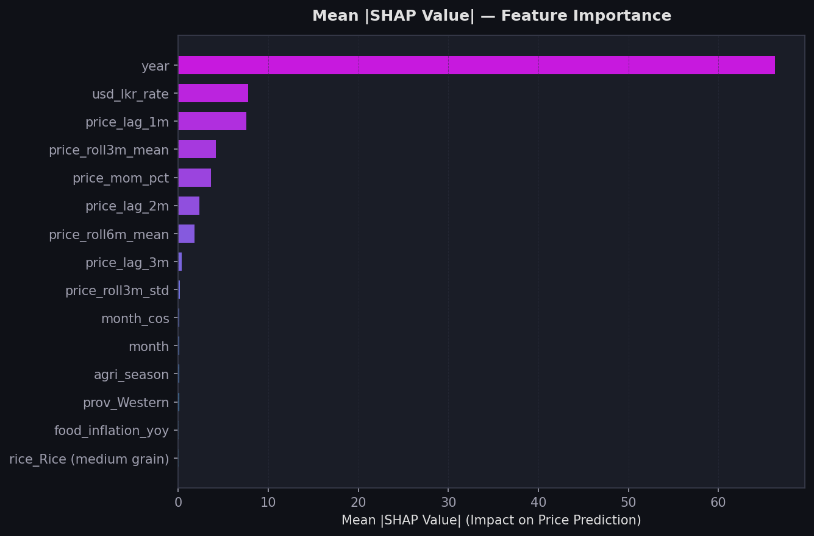
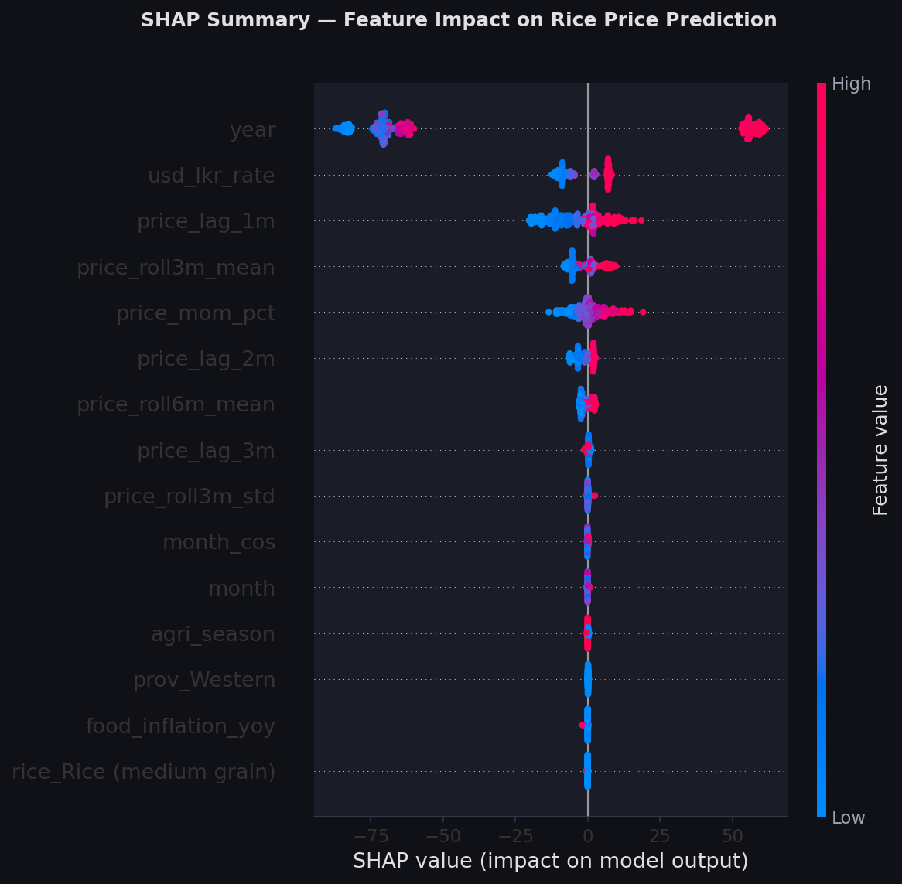
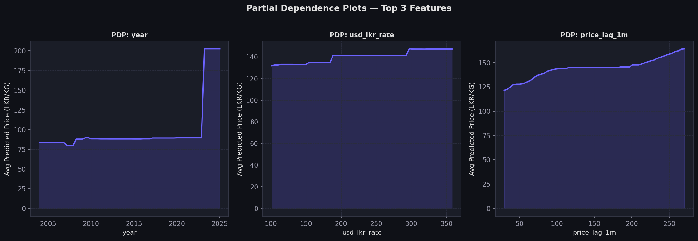

# Comprehensive Machine Learning Project Report
## Subject: Sri Lanka Rice Price Prediction & Forecasting Dashboard

---

### 1. Project Overview & Motivation
Sri Lanka, a nation where rice is the fundamental staple food, has faced unprecedented economic challenges since 2022. Fluctuations in the **USD/LKR exchange rate** and **hyper-inflation** have directly impacted food security. This project aims to build a robust Machine Learning pipeline to:
*   Identify historical price trends of major rice varieties across all 9 provinces.
*   Develop a high-precision forecasting model using **XGBoost**.
*   Deploy a multi-service architecture (FastAPI + Streamlit) containerized with **Docker**.
*   Ensure model transparency through **Explainable AI (XAI)** techniques.

---

### 2. Data Acquisition & Description
The primary dataset was acquired from official humanitarian and economic monitoring sources to ensure data integrity and reliability.

*   **Retail Price Data:** Sourced from the **World Food Programme (WFP)** via the **Humanitarian Data Exchange (HDX)** portal.
    *   **Source Link:** [WFP Food Prices for Sri Lanka - HDX](https://data.humdata.org/dataset/wfp-food-prices-for-sri-lanka)
    *   **Description:** Monthly retail prices (LKR/KG) for key rice varieties across various districts and provinces in Sri Lanka.
*   **Macro-economic Indicators:**
    *   **USD/LKR Exchange Rates:** Collected from historical Central Bank of Sri Lanka records and financial monitoring platforms.
    *   **Food Inflation Rate:** Annual Year-on-Year (YoY) food inflation percentages collected from the Department of Census and Statistics (DCS) Sri Lanka reports.
*   **Dataset Granularity:** The combined dataset provides monthly observations from **2004 to 2025**, covering 5 rice varieties across all 9 provinces.

---

### 3. Data Preprocessing
Preprocessing is a critical phase to ensure the raw data is clean, consistent, and structured for machine learning. The following steps were implemented:

#### 3.1 Data Cleaning & Filtering
*   **Date Normalization:** Raw dates were parsed into standard datetime objects and aggregated at a monthly level to align with macro-economic indicators.
*   **Price Type Selection:** The dataset was filtered to include only **Retail Prices**, as these directly impact the general consumer population.
*   **Column Standardization:** Administrative names (Provinces/Districts) were standardized to resolve naming inconsistencies found in historical records.

#### 3.2 Outlier Removal
The raw dataset contained some noise and erroneous entries that could skew model performance.
*   **Zero Price Filter:** Entries with a price of zero (likely missing data) were removed.
*   **Statistical Thresholding:** We implemented a median-based filtering approach where any price point exceeding **10x the median price** for its category was flagged as an extreme outlier and removed. This prevents the model from learning from data entry errors while still retaining the legitimate price spikes seen during the 2022 economic crisis.

#### 3.3 Feature Engineering
To enable the model to capture time-series momentum and seasonality:
*   **Lag Features:** We created 1, 2, and 3-month lagged versions of the price to capture auto-correlation (today's price is highly dependent on last month's).
*   **Rolling Statistics:** Calculated 3-month and 6-month moving averages to help the model identify medium-term trends.
*   **Seasonality Encoding:** Sri Lanka's agricultural seasons (*Maha* and *Yala*) were encoded as binary flags. Additionally, sine/cosine transformations were applied to the month number to represent the cyclical nature of the calendar year.
*   **Categorical Encoding:** Provinces and Rice Varieties were converted into numerical format using **One-Hot Encoding**, allowing the XGBoost model to treat them as independent features.

---

### 4. Exploratory Data Analysis (EDA) Insights

#### 4.1 Historical Price Trends
The historical trend clearly shows the relative stability pre-2022 followed by a massive structural break during the economic crisis.

#### 4.2 Economic Inter-dependencies
The correlation analysis confirms that the USD/LKR rate and inflation are the primary external drivers of retail rice prices.

**Key Findings:**
1.  **Price Shock (2022):** A massive spike in early 2022 corresponds exactly with the currency devaluation.
2.  **Province Variation:** Different supply chain dynamics are visible across provinces, though the overall trend remains synchronized.
3.  **USD Sensitivity:** Retail rice prices show a near-perfect correlation with the USD/LKR rate.

---

### 5. Model Selection & Methodology
We compared several models using a chronological 70/15/15 split:
*   **Linear Regression:** Baseline; fails to capture the complexity of the crisis period.
*   **Decision Tree:** Handles non-linearity but struggles with generalizability.
*   **Random Forest:** Strong performance but less efficient than XGBoost.
*   **XGBoost (Extreme Gradient Boosting):** Optimized gradient boosting with L1/L2 regularization.

---

### 6. Results & Model Evaluation

#### 6.1 Performance Comparison
XGBoost significantly outperformed baseline models across all accuracy metrics.

| Model | RMSE | MAE | R² Score | MAPE (%) |
| :--- | :--- | :--- | :--- | :--- |
| Linear Regression | 7.50 | 4.03 | 0.9903 | 2.33% |
| Decision Tree | 9.87 | 3.73 | 0.9832 | 2.58% |
| Random Forest | 8.38 | 2.25 | 0.9879 | 1.33% |
| **XGBoost (Final)** | **2.76** | **1.47** | **0.9987** | **1.01%** |

#### 6.2 Prediction Analysis
The "Actual vs Predicted" plot shows that XGBoost maintains high linearity even at extreme price points reached during the crisis.

#### 6.3 Residual Analysis
Residuals are centered around zero and show a near-normal distribution, indicating no systematic bias in the model's errors.

---

### 7. Explainable AI (XAI) Interpretation

#### 7.1 Global Feature Importance
SHAP analysis reveals which features dominated the model's decision-making process.

#### 7.2 Non-linear Relationships (PDP)
Partial Dependence Plots show how individual features impact the price while averaging out others.

**Key Interpretations:**
*   **Auto-correlation:** Recent price history (`price_lag_1m`) is the strongest predictor.
*   **Macro-drivers:** The model assigns heavy weights to the **USD/LKR rate**, showing it has effectively learned the macro-economic impact of the currency crisis.

---

### 8. System Architecture
The project uses a containerized microservices stack:
1.  **Backend (FastAPI):** High-performance API for real-time model inference.
2.  **Frontend (Streamlit):** Interactive dashboard for visualization and user input.
3.  **Orchestration (Docker):** Cohesive deployment via Docker Compose.

---

### 9. Conclusion
This project demonstrates that high-precision rice price forecasting is achievable by combining historical time-series data with macro-economic indicators. By using XGBoost and SHAP, we provide both accurate forecasts and the economic reasoning behind them, creating a tool that is both powerful and trustworthy for decision-makers.
